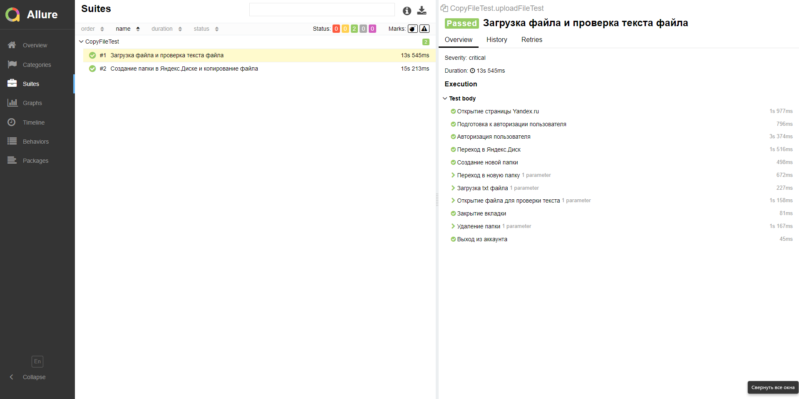
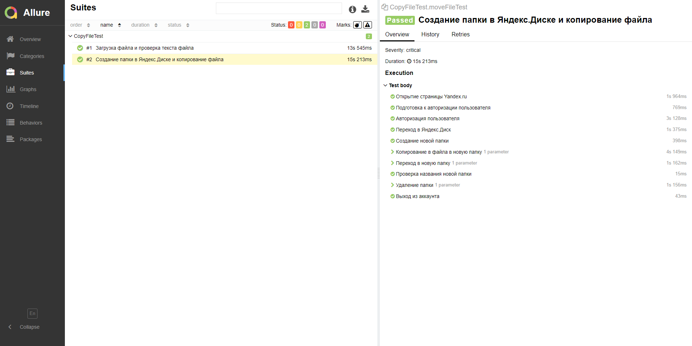

 # Yandex-UI-Test
Тестирование UI интерфейса Яндекс диска
  Тест 1:
 Создание новой папки
 Копирование подготовленного файла в новую папку
  Тест 2:
 Создание новой папки
 Загрузка подготовленного файла
 Проверка текста файла (не проверяет)
  Запуск:

 -mvn clean test 

 Запуск Allure отчета:
 

 -mvn clean verify allure:serve 

 Задействованы инструменты:
<ul>
<li>Java (JDK17)</li>
<li>Maven</li>
<li>Junit4</li>
<li>Selenium</li>
<li>Allure</li>
</ul>

 

